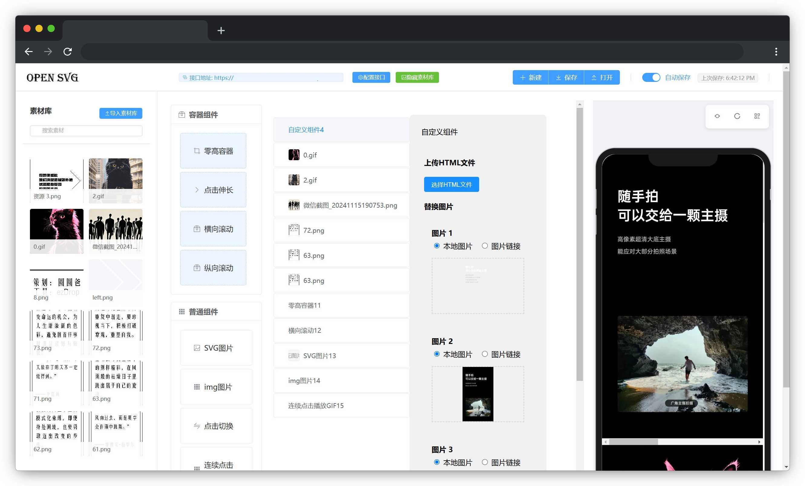

# WeChat Editor - OpenSVG 微信公众号SVG编辑器

一个开源免费的微信公众号SVG编辑器,帮助运营人员快速制作微信公众号图文内容。如需使用，可以点击这里[https://cailven.github.io/opensvg/],教程在项目的wiki页里，建议在使用前仔细阅读[https://github.com/cailven/opensvg/wiki]



## 主要功能

### 1. 组件系统
- SVG图片组件 - 支持SVG动画效果
- 普通图片组件 - 支持点击长按识别
- 零高容器组件 - 用于制作折叠展开效果
- 点击切换组件 - 实现图片点击切换效果
- 点击伸长组件 - 实现内容展开动画
- 连续点击GIF组件 - 支持多帧动画播放
- 自定义HTML组件 - 支持导入自定义HTML内容

### 2. 素材管理
- 素材库功能
- 支持本地上传
- 支持API配置
- 支持拖拽使用

### 3. 项目管理
- 项目保存/导入
- 自动保存功能
- 实时预览
- 手机预览
- 代码导出

### 4. 编辑功能
- 组件树编辑
- 拖拽排序
- 属性配置
- 动画编辑

## 快速开始

```sh
npm install
```

### Compile and Hot-Reload for Development

```sh
npm run dev
```

### Compile and Minify for Production

```sh
npm run build
```
